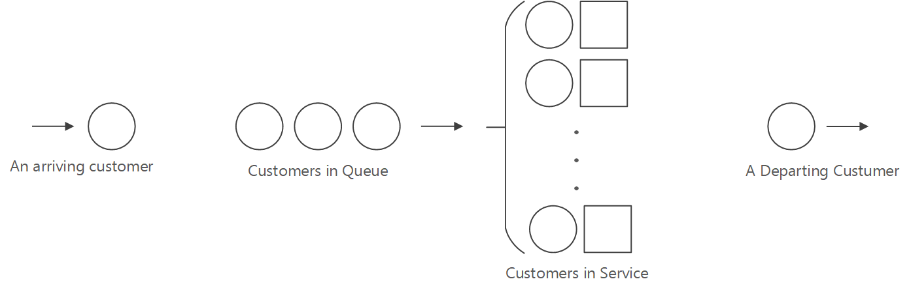

MS-HACKATHON-2022
=================

# **Understanding and Improving Customer Onboarding Experience Using Discrete Event Simulation**

The following describes the problem, constraints, and assumption made when modeling ATS' onboarding process using discrete event simulations (DES) -- collectively called the **study**. This study is intended to simulate people operating in a simulated system, consisting of two sequential services within a queueing system. The study is meant to represent current conditions and not a future state or process. The study is broken into the following sections:

1. [Problem Formulation and Study Design](#problem-formulation-and-study-design)
2. [Collecting Data and Defining the Model](#collecting-data)
3. [Assumptions Made in Model Definition](#defining-the-model)
4. [Discrete Event Simulation using SimPy](#discrete-event-simulation-using-simpy)
5. [Simulation Outputs and Observations](#simulation-outputs-and-onbservations)
6. [Recommended Actions and Next Steps](#next-steps-and-recommended-actions)

# Problem Formulation and Study Design

A customer wanting to use ATS (ATS.Service) must complete a multi-step sequence of tasks that may take several weeks to finalize. The onboarding process requires back-and-forth exchanges of information, and some tasks in the onboarding flow can only be performed by specialists.  This study aims to used DES to identify and understand ways to improve the customer's experience during the ATS onboarding process -- either by identifying areas where variations in the system's processes can be used to improve the overall system, or by improving the experience in areas where the system's processes, as they stand, cannot be improved.

Whenever a 1P customer wants to onboard to ATS' solutions they complete various processes within a system that can be broken down to two main subsystems: 

1. **Getting to Know ATS** -- involves a manual back-and-forth exchange of information about ATS and the customer's scenarios. This process ends when ATS has all the necessary information to onboard the customer. 
2. **Tenant Onboarding** - involves the manual process of using the customer's provided information to deploy SF clusters containing ATS solutions on their behalf.

**Note:** The following terms are used throughout the document:

- **Customer** - a customer is a any service wanting to onboard to ATS Solution
- **Server** - an ATS engineer that is responsible for completing one, many, or all of the customer-onboarding processes.
- **Service** - the act of carrying out and completing a process, performed by a Server.
- **Event** - an instantaneous or temporal occurrence that may change the system state.
- **Resource** - are Servers. i.e., ATS Engineers, that ATS makes available to its customers 
- **Process** - a simulation construct that encapsulates a customer using a resource that leads to a transition event.  
- **Arrival Rate ($\lambda$)** is the number of customers arriving per unit time -- a Poisson process at a rate of $\lambda = 1/E(A)$, where $A$ is the arrival time.
  - e.g., 3 customers per week.
- **Service Rate ($\mu$)** is the number of customers that a single server can serve per unit time -- each customer requires an exponentially distributed service time period with an average service rate of $\mu = 1/E(S)$, where $S$ is the time it takes to complete a service.
  - e.g. 1 week per customer => 4 customers per month.
- **Number of servers ($c$)** is the number of servers that can serve a customer -- that is, perform the necessary task(s) to move the customer past servicing processes and having them exit the system. 

## Getting to Know ATS

The first subsystem of the ATS customer flow can be broken down to the following processes:

1. **START:** A customer arrives at ATS' site. They may have found the site through word of mouth, by searching, or by being redirected there by an ATS team member.
2. The customer spends some time familiarizing themselves on the information and actions that will be required of them. This annealing process is generally involves multiple email exchanges between the customer and ATS engineer(s). 
3. **END:** the Getting to Know ATS process ends when a customer submits the required information for an ATS engineering to onboard customer to ATS.

For details and assumption on the modeling approach for the Getting to Know ATS sub-process, see [Modeling 'Getting to Know ATS' Subsystem Using GI/G/s Queue](#modeling-getting-to-know-ats-system-using-gigs-queue)

## Tenant Onboarding

The second subsystem, Tenant Onboarding, can be broken down to the following processes:

1. **START:** A customer arrives at the onboarding queue once they've completed the prerequisite ADO ticket. The on-call engineer then works with customer to address issues with ticket. 
2. One or more ATS engineers communicate with customer to understand scenarios and to generally educates the customer on ATS solutions. This type of engagement occurs at least once while the customer is undergoing the onboarding process.
3. **END:** a customer has been fully served when their tenant has been onboarded, and they have received an email notification of onboarding completion.

For details and assumptions on the modeling approach for the Tenant Onboarding sub-process, see [Modeling 'Tenant Onboarding' Using M/M/c Queue](#modeling-tenant-onboarding-using-mmc-queue)

# Collecting Data and Defining the Model

The following section describes the process by which data for defining the model was acquired. 

## Collecting Data

To understand the ATS onboarding flow, several interviews with ATS engineers we carried out. As part of the interviews, estimate times for processing each step were also collected.

**Limitations:** Given that this study is a learning project, carried out during Hackathon week, it should be noted that there are several limitations in the data acquisition approach and process definitions used in this study. In a 'production' grade study, the following considerations would have been carried out:

1. *Iteratively Formulate the problem and plan the study*
    1. Problem of interest would be discussed with management.
    2. Problem would be stated in quantitative terms.
    3. Hold one or more kickoff meetings for the study to be conducted, with the project 
management, the simulation analysts, and subject-matter experts (SMEs). The following things would be discussed:
        1. Overall objectives of the study
        2. Specific questions to be answered by the study (required to decide level of model detail)
        3. Performance measures that will be used to evaluate the efficacy of different system configurations
        4. Scope of the model
        5. System configurations to be modeled (required to decide generality of simulation program
        6. Time frame for the study and the required resources
2. *Collect data and define a model*
    1. Collect information on the system structure and operating procedures.
        1. No single person or document is sufficient.
        2. Statistical sampling techniques should be issued, and documented in assumptions document.
        3. Careful attention would be paid to the formalization of the procedures.
    2. Collect data sets (if possible) that can be used to specify model parameters and input probability distributions.
    3. A description of the above information and data in a written assumptions document. 
    4. Collect data (if possible) on the performance of the existing system (for benchmarking and validation purposes.
    5. The level of model detail would be chosen based on the following:
        1. Project objectives
        2. Performance measures
        3. Data availability
        4. Credibility concerns
        5. Computer constraints
        6. Opinions of SMEs
        7. Time and money constraints
    6. Careful model analysis would be carried out to ensure there is no one-to-one correspondence between each element of the model and the corresponding element of the system.
    7. Models would be iteratively improved as needed to ensure the model can be used to make effective decisions, and that it does not obscure important system factors.
    8. Ongoing interactions with management (and other key project personnel) would be maintained on a regular basis
3. *An assumptions document would be created and maintained*
    1. As part of document maintenance I would perform a structured walk-through of the assumptions document before an audience of managers, analysts, and SMEs. This will:
        1. Help ensure that the model’s assumptions are correct and complete
        2. Promote interaction among the project members
        3. Promote ownership of the model
        4. Take place before programming begins, to avoid significant reprogramming later
4. *Construct, debug, verify a computer program (computational simulation)*
5. *Make pilot runs*
    1. Pilot runs would be executed to explore answers to some of the questions/goals defined earlier, and/or to test hypotheses about a process or a system.
6. *Validate the simulation model*
    1. Compare simulation to baselines and or other systems (if they exist)
    2. Perform a structured analysis of the simulation with management, the simulation analysts, and SMEs to evaluate the model results for correctness.
    3. Use sensitivity analyses to determine what model factors have a significant impact on performance measures and, thus, have to be modeled carefully.
7. *Design experiments*
    1. Specify the following for each system configuration of interest:
        1. Length of each simulation run
        2. Length of the warmup period, if one is appropriate
        3. Number of independent simulation runs using different random numbers to construct confidence intervals
8. *Make production runs*
9. *Analyze output data*
    1. Two major objectives in analyzing the output data would be:
        1. Determine the absolute performance of certain system configurations
        2. Compare alternative system configurations in a relative sense 
10. *Document, present, and use results*
    1. Document assumptions, simulation program, and study’s results for use in current and future projects.
    2. Present study’s results.
        1. Discuss model building and validation process to promote credibility.
        2. Results are used in decision-making process if they are both valid and credible.

## Defining the Model

As previously mentioned, the ATS onboarding flow can be broken down to two core components: (1) Getting to Know ATS, and (2) Tenant Onboarding. Getting to Know ATS is the subsystem by which a customer arrives at a Server that ensures the customer arrives at the necessary knowledge state to undergo tenant onboarding, while Tenant Onboarding is the subsystem by which ATS clusters are deployed on behalf of the customer. The description of the general modeling considerations, and subsystems' approaches used in this study follow.

### General Simulation Description

The simulation beings in an "empty-and-idle state;" i.e., no customers are present and the server is idle. At time 0, we begin waiting for the arrival of the first customer, which occurs after the first interarrival time $A_1$, rather than at time 0. We wish to simulate this system until a fixed number  $(n)$ of customers have completed their delays in queue, and they have been served -- i.e., the simulation end when the $n$ -th customer enter Service.

To measure the performance of the system we will look at estimates of the following quantities:

1. The **expected average delay in queue** of the $n$ customers completing their delays during the simulation -- denoted by $d(n)$. Where $d(n)$ is the average of a large, finite, number of $n$-customer delays. From a single run of the simulation resulting in customer delays $D_1, D_2, \dots, D_n$ we have an estimator of $$\hat{d}(n)=\frac{\sum_{i=1}^n D_i}{n}$$

2. The **expected average number of customers in the queue** that are not being served -- denoted by $q(n)$. Then, given the number of customers in queue at time $t$ is $t\ge0$, $$\hat{q}(n)=\sum_{i=0}^{\infty} iP_i$$ 
is the weighted average of the possible values of $i$ for the queue length $Q(t)$. If we let $T_i$ be the total time during the simulation that the queue is of length $i$, then $T(n) = T_0+T_1+\cdots$ and $P_i=T_i/T(n)$ we have  $$\hat{q}(n)=\frac{\sum_{i=0}^{\infty} iT_i}{T(n)}$$

3. The **expected utilization of the server** is the expected proportion of time during the simulation (from time 0 to time $T(n)$) that the server is busy serving a customer -- denoted by $u(n)$. From a single simulation we have for a 'busy function' $B(t)$ where $B(t)=1$ if the server is busy at time $t$ and $B(t)=0$ if server is idle at time $t$ we $$\hat{u}(n) =\frac{\int_0^{T(n)}B(t) ~dt}{T(n)}$$

 

### Modeling Getting to Know ATS System Using GI/G/s Queue

#### Problem Statement

A customer can inquire about ATS' solutions at any point in time -- shown in the diagram as arriving at the 'Get-Help Desk.' We assume that the interarrival times of customers are IID Poisson random variables. Each Server, i.e., an ATS engineer (gen. 2 max), will have a separate queue. An arriving customer joins the queue for the first server to engage said customer. A customer is leaves the subsystem when a server completes all processes for a customer. 

A common way of simulating independent queues in which a customer can switch between servers, known as jockeying, is done through a [multiteller bank with jockeying](http://tdesell.cs.und.edu/lectures/cs445-03-modeling_complex_systems.pdf) simulation. In our case, instead of a customer switching tellers to one with a shorter queue, a customer switches servers when the on-call rotation of the lead terminates and they pass the customer to the new on-call lead.

#### Assumptions

1. Either an on-call dev of a more senior engineer fields questions from a customer that is interested in on-boarding to ATS. 
2. A customer can arrive at the 'Get-Help Desk' at any time of the day, but ATS only fields questions from 8am to 5pm. As such, an arrival that happen at 5pm on a Friday will not be engaged until 8am on the following Monday (63 hrs total). 
3. The number of ADO engineers that can serve a customer during any one process are interchangable. That is an `on_call_eng`, can serve as a `verify_eng` (details below).
4. If a meeting is scheduled, either one or many of the ATS engineers attend.
5. For simplicity purposes, we assume that the customer takes at least a full workday to collect the information and attain the necessary knowledge to file onboarding ticket. The customer is assumed to be eager, thus it it will not take more than a full week for the customer to have completed the 8 hours worth of work required.
6. If a meeting is schedule, the meeting is assumed to be one-time, hour-long, event that is scheduled at a minimum of 24hrs in advance. For example, if a meeting is schedule on Monday at 9am for the earliest available slot, the meeting would conclude at 10am on Tuesday (total of 25hrs).

#### Subsystem's Flow
Following is a breakdown of the steps a customer might take as part of completing the Getting to Know ATS subsystem:

1. Arrive at ATS and wait to be engaged.
2. Ask questions and request resources.
3. Wait to have question answered and requests met.
4. Collect required information, or complete learning requirements
5. Choose to schedule a meeting
    - if they schedule a meeting, then they meet
    - if they don't schedule a meeting, they skip to the last step.
6. Complete and submit ADO ticket.

#### Event Descriptions

| Event description | Event type | Notes |
|----- | ----- | ----- |
| Arrival of a customer to the 'Get Help Desk' | 1 | -- |
| Exchanges of information | 2 | There may be multiple exchanges that affect the system's state.  For simplicity, we only consider a single transition from 'not having enough knowledge' to 'having sufficient knowledge' to onboard to ATS. |
| End of sup-system simulation | 3 | This is achieved when an ADO ticket is submitted. |

 

### Modeling Tenant Onboarding Using M/M/c Queue

#### Problem Statement

The Tenant Onboarding subsystem is essentially a linear progression that begins when a customer arrives at the queue, i.e., the customer submitted an ADO work item, and terminates when the customer's tenant is onboarded. A customer who arrives and finds the server idle enters service immediately with a service time that is independent of the interarrival times. A customer who arrives and finds the server busy joins the end of a single queue. A server can serve multiple customers in parallel. Upon completing the service for a customer, the server chooses a customer from the queue (if any) in a first-in, first-out (FIFO) manner. A customer has exited the subsystem when they are notified that their tenant onboarding has been completed.

[Single Server Queueing System](https://www.cs.wm.edu/~esmirni/Teaching/cs526/section1.2.pdf) simulation is a common way of modeling systems such as the Tenant Onboarding sup-system.

#### Assumptions

1. A on-call engineer will take the ADO ticket and commence the tenant onboarding process
2. It may be the case that the on-call engineer requires additional information from customer, which can lead to correspondence exchanges and or to meetings. For simplicity, the delay introduced to the systems is assumed to be negligible.
3. Once having all the necessary information, and verifying that the customer has completed all prerequisite steps for tenant onboarding, the on-call engineer deploys SF clusters using safe deployment practices (SDP). Because SDP can take 2+ weeks to complete, the influence of any other process that introduces delay in the system is assumed to be captured in the variance of tenant deployment process. Hence the influence of any other process is assumed to be negligible.
4. An on-call engineer can tenant onboard multiple customers at the same time. 
5. Service times are assumed to be exponential processes, with a minimum equivalent to the time SDP takes.
6. Any delay introduced into the subsystem by the 'end of onboarding process' notification is assumed to be negligible.

#### Subsystem's Flow
Following is a breakdown of the steps a customer might take as part of completing the Tenant Onboarding subsystem:

1. Arrive at ATS tenant and wait to be engaged.
2. Verify ticket, and meet pre-requirements (negligible time).
3. Have SF cluster deployed on customer's behalf.
4. Receive notification of completed tenant deployment.

#### Event Descriptions

| Event description | Event type | Notes |
|----- | ----- | ----- |
| Arrival of a customer to the 'Tenant Onboarding' | 1 | -- |
| Tenant Onboarding | 2 | Because SDP introduces the majority of the delay in to the subsystem, for simplicity, the delay contribution of any other sup-process to the tenant onboarding process is assumed to be captured in the variance for the tenant onboarding process. Thus the contribution in delay by other sub-processes is negligible. |
| End of sup-system simulation | 3 | This is achieved when customer is notified of the completion of their tenant onboarding. |

 

### General Simulation Assumptions 

- Interarrival times $A_1, A_2, \dots$ are independent and identically distributed (IID) random variables -- that is, they all have the same probability distribution)
- All servers are identical
- All customers are identical
- A customer who arrives and finds the server idle enters service immediately, and the service times $S_1, S_2, \dots$ of successive customers are IID.
- A  customer who arrives and finds the server busy joins the end of a single queue.
- One server can only serve one customer at a time, unless specified in the subsystem assumptions.
- Upon completing service for a customer, the server chooses a customer from the queue in a first-in, first-out manner.
- Customers experience more pain *while* waiting to be served than while *being* served. Pain(expected average waiting time in system) > Pain (expected average delay in queue)
- In order to use discrete events, as opposed to continuous events, we must consider time as discrete units. A unit of time can be anywhere between 0 and infinity, so long as the counting units are integers.
- Any engineer that can field questions during Getting to Know ATS stage and/or Tenant Onboarding stage, is assumed to have the knowledge of the group. For example, a meeting can include multiple ATS engineers, but the outcome of 'attaining the required knowledge to submit an ADO ticket' is the same independent of the combinatorics.
- Each process is assumed to be sufficiently generalized for modeling purposes -- e.g., every engineer either performs the same sequence of tasks, or the tasks between 1st and nth can be interchanged without affecting the characteristics of the process.
- Each subsystem is assumed to be independent.

# Discrete Event Simulation using SimPy

Following is the process, resources, and parameters used in 'Getting to Know ATS' simulation. See `help_desk_simulation.ipynb` for code.

## Getting to Know ATS - Processes and Resources

| Process | Resource Request |  Notes |
| ---------- | ---------- | ---------- |
| `get_help` | Requests an `help_desk_eng`| Used to track resources used in fielding customer questions |
| `collect_complete` | Requests an `on_call_eng` | Used to track resources used in ensuring customer has necessary knowledge to submit a ticket -- it includes the time it takes to complete pre-requisites, and may include additional meeting time |
| `verify_ticket` | Requests a `verify_eng` | Used to capture when a customer exists the subsystem, which occurs when they submit an ADO ticket|

## Getting to Know ATS - Parameters

| Name | Purpose |
| ---- | -----|
| `customer` | keeps track on customer(s) as they move through the system |
| `num_help_desk_eng` | keeps track of allocation of ATS engineering resources to serve as `help_desk_eng`|
| `num_on_call_eng` | keeps track of allocation of ATS engineering resources to serve as `on_call_eng`|
| `num_verify_eng` | keeps track of allocation of ATS engineering resources to serve as `verify_eng`|
| `wait_times` | used to keep track of time being spent in each Resource |
| `NUM_SIMULATIONS` | user-defined parameter that sets the maximum number of variations on resource allocation and their influence on the system's flow, to be considered | 
| `MAX_ENGINEERS` | user-defined parameter that sets the maximum number of resources, and their allocations, that can be simultaneously active across one or more processes during a simulation run.

 

Following is the processes, resources, and parameters used in 'Tenant Onboarding' simulation. See `tenant_onboarding_simulation.ipynb` for code.

## Tenant Onboarding - Processes and Resources

| Process | Resource Request |  Notes |
| ---------- | ---------- | ---------- |
| `request` | Requests an `arrival` resource| Used to track customers entering the subsystem's queue |
| `release` | Requests a `serve` resource | Used to track variability in the tenant onboarding process-duration, as well as the time it takes the customer to exit the simulation | 

## Tenant Onboarding - Parameters

| Name | Purpose |
| ---- | -----|
| `service_time` | minimum time to be considered under SDP |
| `wait_times` | keeps track of expected-average end-to-end wait times for entire simulation |
| `customer_times` | keeps track of expected-average delays in the queue. These are delays not associated with the carrying out of the process | 
| `total_service_time` | used to compute utilization metrics |
| `ARRIVAL_TIME` | user-defined parameter is used to create Poisson Distribution arrival times to the queue |
| `TIME_TO_COMPLETE` | user-defined parameter is used to create Exponential Distribution service times. That is, the time it takes a server to serve a customer |
| `SIM_TIME` | user-defined parameter used as stopping condition for simulation. SIM_TIME is set to run for half-a-year |

# Simulation Outputs and Onbservations

## help_desk_simulation.ipynb

The simulation to the 'Get to Know ATS' subsystem, `help_desk_simulation.ipynb`, was executed multiple times, each execution consisting of ten sequential, independent simulations. As the help_desk_simulation increases in the amount of resources available for serving customers, a few observation become apparent: 

1. Given three processes that must be completed, there is diminishing returns in scaling past 5 resources.
2. If only 5 resources can be allocated, invest them as `num_help_desk_eng=1`, `num_on_call_eng=3`, `num_verify_eng=1` as they result in the lowest average time over an entire semester of simulated operation:  `average_time=503.419355`
3. If more than 5 resources are available, heavily consider whether or not to allocate them to the subsystem as simulated. Each additional resource allocated yields a reduction of less than ten minutes to the average time over an entire semester of simulated operation.  

## tenant_onboarding_simulation.ipynb

The simulation to the 'Tenant Onboarding' subsystem, tenant_onboarding_simulation_ipynb, was executed multiple times. Each execution represents a semester's worth of simulations (based on the currently estimated arrival rates). A summary of the findings follow:

1. The expected-average E2E waiting time (in days) for a customer commencing the Tenant Onboarding process is ~18 days (most recent simulation).
2. The same customer can expect an expected delay in queue of ~4 days. These days are 'taxes' from the systems's design and not associated with the actual, and necessary, onboarding tenants to SF cluster tasks.
3. Over the course of the semester, a server can expect ~6 customers waiting to be served.
4. To meet the stated expected averages, an ATS engineer is simultaneously serving 3 customers. 

# Next Steps and Recommended Actions

As described in the outputs and observations section, above, there are two main areas that drive underutilization in the simulation -- namely, resource allocation and server utilization. An back-of-the-napkin recommendation would be to increase the number of engineers that handle the full onboarding flow to a minimum of 3. Moreover, having each server act as each of the three resources in the 'Get to Know ATS' subsystem, and simultaneously onboard as many customers during the 'Tenant Onboarding' subsystem would greatly reduce the expected onboarding time for a customer.

Given that budgets and strategic planning may not alow for the allocation or repurposing of resources, an inexpensive way to improve customer experience is through engagement and communication. A couple of examples follow:

1. If the time to engage during a customer entering the queue for the 'Get to Know ATS' subsystem cannot be reduced, automate auto-responses that detail what is needed from customers to onboard to ATS solution -- including links to assets, faq's, and ways to contact ATS.
2. Delays caused by SDP are unavoidable. The best the 'Tenant Onboarding' subsystem can perform -- in its current architecture/design -- is to delay only as long as SDP. Since SDP can take ~2 weeks, making the customer aware of progress, akin to shipping information, would be a way to inform and delight customers. For example, when the customer submits their ADO ticket, an email containing descriptions of steps that will be performed, the expect time to complete each step, link to ways they can remain updated with the status of their deployment, and quick links to resources could be included.

Future work should be focused on iteratively improving the simulations while following proper study design methodology, as described in the [Data Collection](#collecting-data) section above. 